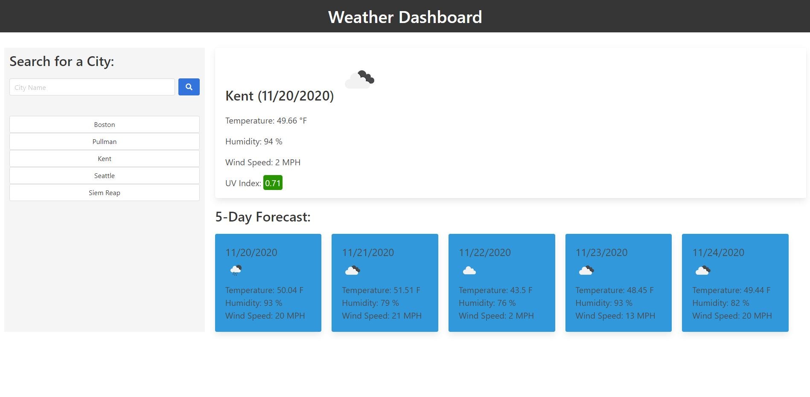
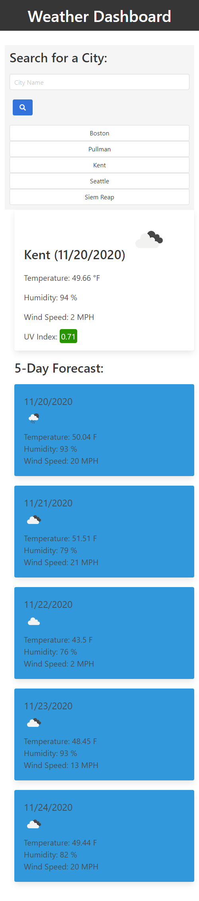

# Weather-Dashboard

The app is used to show the weather outlook for multiple cities. User can use it to check current and future weather conditions, temperature, humidity, wind speed, and the UV index for cities.

This app is develope with Server-Side APIs: Weather Dashboard (OpenWeather API, https://openweathermap.org/api).

## Application Feature

- Work in the browser and feature dynamically updated HTML and CSS and responsive.
- Present current information of the city with city name, the date, an icon representation of weather conditions, the temperature, the humidity, the wind speed, and the UV index.
- Present a 5-day forecast of the city, the date, an icon representation of weather conditions, the temperature, and the humidity.
- UV index has a color that indicates whether the conditions are favorable, moderate, or severe.
- Save the city name in search history and create buttons for later use without typing the city name again (the search history is limited to five cities). 
- When page load it display the current and forecast weather condtion of the last searched city.

## Programming Language
HTML, CSS, JavaScript, jQuery, Bulma CSS framework.

## Desktop Layout

## Mobile Layout

